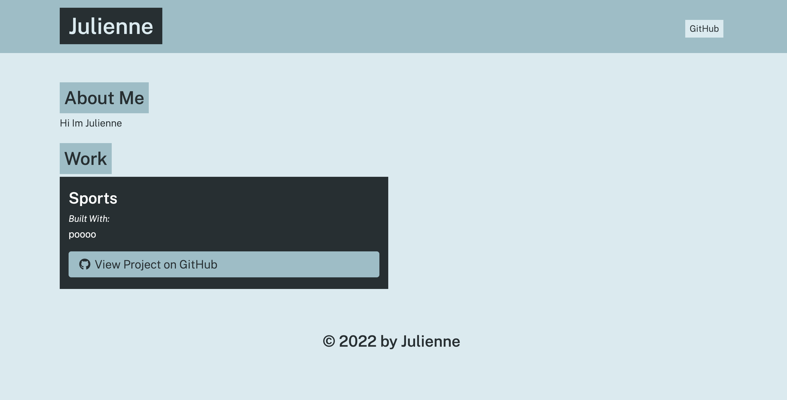

# portfolio-generator

# Description
My project is a Profile generator. The project will help a user generate a Profile without having to worry about applying proper mark down syntax.

# Installation
After installation is complete, run the following code: ‘npm start
’ in the terminal. Answer the prompts and after completion, you should see a console log showing your answers to your prompts, a message that says ‘File created!’, and you should see your file under the ‘dist’ folder called ‘generatedREADME’. It’s generated in mark down syntax so you can copy and paste that code into your project!

# repository
https://github.com/jkgdev8/portfolio-generator

# preview

